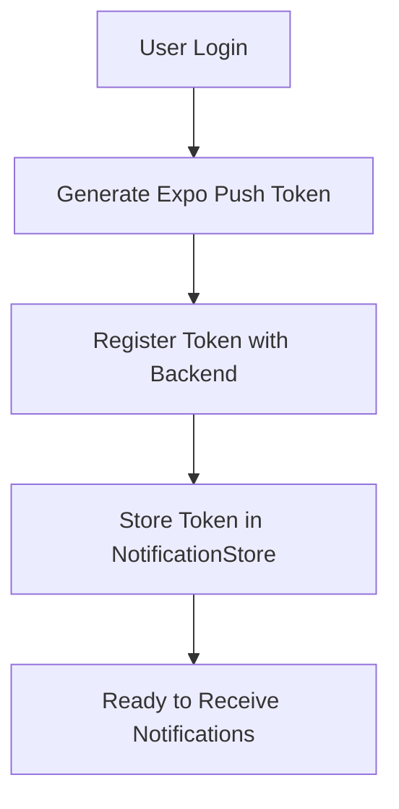
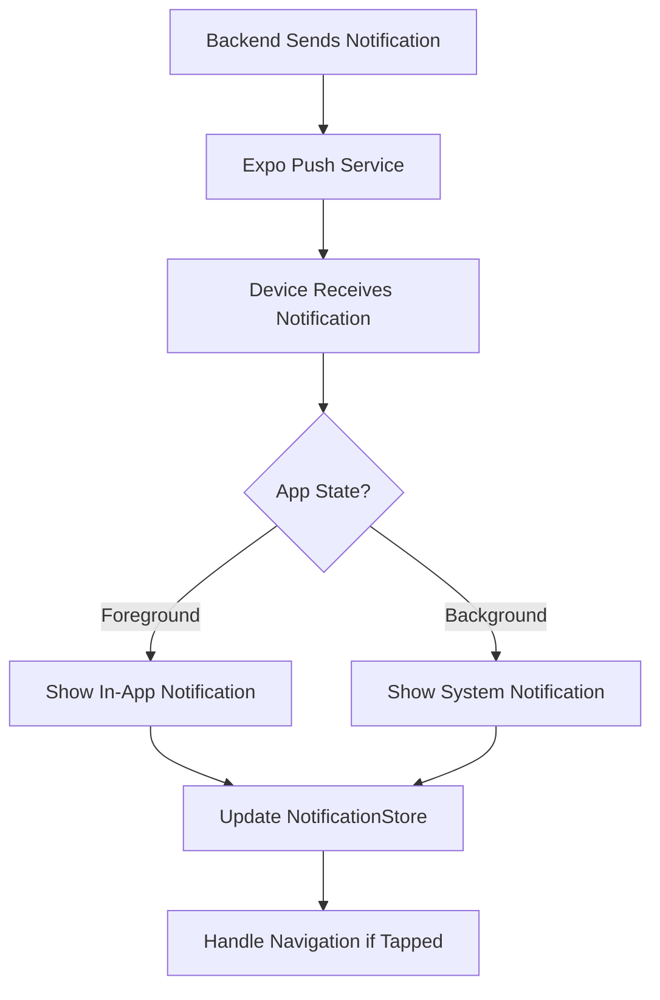
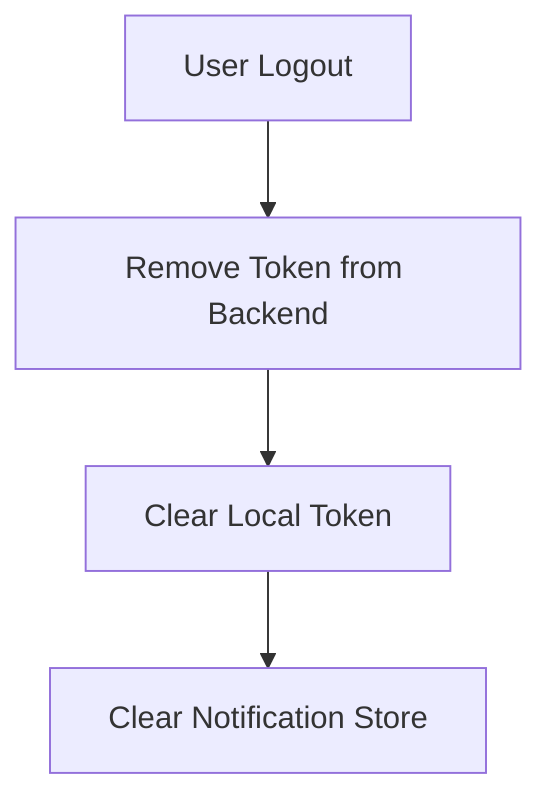

# Push Notification System Documentation

## Overview

This document describes the push notification system implemented in the app, including the setup, flow, and different types of notifications.

## Setup and Dependencies

### Required Packages

```json
{
  "expo-notifications": "^latest",
  "expo-device": "^latest"
}
```

### Configuration

1. app.json settings:

```json
{
  "expo": {
    "notification": {
      "icon": "./assets/notification-icon.png",
      "color": "#ffffff",
      "androidMode": "default",
      "androidCollapsedTitle": "#{unread_notifications} New Notifications",
      "iosDisplayInForeground": true
    }
  }
}
```

2. Required Android permissions:

```json
{
  "android": {
    "permissions": [
      "NOTIFICATIONS",
      "android.permission.RECEIVE_BOOT_COMPLETED",
      "android.permission.VIBRATE",
      "android.permission.WAKE_LOCK"
    ]
  }
}
```

## Notification Flow

### 1. Registration Flow



### 2. Receiving Notifications Flow



### 3. Logout Flow



## Notification Types and Screen Navigation

### Order Related

1. `order_update`

- **Screen**:
  - ADMIN/SECRETARY → OrderDetail
  - Others → NotificationScreen
- **Description**: Updates about order status changes
- **Screen Content**:
  - Current order status
  - Timeline of updates
  - Order details (menu items, quantity)
  - Delivery information
  - Comments and special instructions

2. `order_assigned`

- **Screen**: OrderDetail (all roles)
- **Description**: Notification when order is assigned to staff
- **Screen Content**:
  - Order details
  - Assignment information
  - Delivery/pickup requirements
  - Contact information

3. `order_completed`

- **Screen**: OrderDetail (all roles)
- **Description**: Order completion notification
- **Screen Content**:
  - Final order status
  - Completion details
  - Delivery confirmation
  - Rating/feedback option

### Kitchen Related

1. `kitchen_update`

- **Screen**:
  - KITCHEN → KitchenOrderDetail
  - ADMIN → OrderDetail
  - Others → NotificationScreen
- **Description**: Updates about kitchen-specific order status
- **Screen Content**:
  - Preparation status
  - Special instructions
  - Menu items and quantities
  - Dietary requirements
  - Time deadlines

2. `kitchen_new_order`

- **Screen**: KitchenOrderDetail (KITCHEN role)
- **Description**: New order that needs kitchen attention
- **Screen Content**:
  - Order details
  - Menu items to prepare
  - Special instructions
  - Preparation timeline
  - Dietary restrictions

### Secretary Related

1. `secretary_approval_needed`

- **Screen**:
  - SECRETARY → OrderDetail
  - ADMIN → OrderDetail
  - Others → NotificationScreen
- **Description**: Request for secretary approval on orders
- **Screen Content**:
  - Order details requiring approval
  - Approval buttons
  - Comments section
  - Order history

### Driver Related

1. `driver_pickup_ready`

- **Screen**: OrderDetail (DRIVER role)
- **Description**: Notification when order is ready for pickup
- **Screen Content**:
  - Pickup location
  - Order details
  - Customer information
  - Delivery instructions
  - Navigation link

2. `driver_assigned`

- **Screen**: OrderDetail (DRIVER role)
- **Description**: New delivery assignment notification
- **Screen Content**:
  - Order summary
  - Pickup/delivery addresses
  - Time requirements
  - Customer contact info
  - Route information

### General Notifications

1. `general_announcement`

- **Screen**: NotificationScreen (all roles)
- **Description**: System-wide announcements
- **Screen Content**:
  - Announcement details
  - Related links/actions
  - Date and time
  - Priority level

2. `profile_update`

- **Screen**: ProfileScreen (all roles)
- **Description**: Updates about user profile
- **Screen Content**:
  - Profile information
  - Update details
  - Action required (if any)
  - Settings options

## API Endpoints

### Register Push Token

```http
POST /push-tokens
Authorization: Bearer <token>
Content-Type: application/json

{
  "token": "ExponentPushToken[xxx]",
  "device": "iPhone 12",
  "isActive": true
}
```

### Remove Push Token

```http
DELETE /push-tokens/token/ExponentPushToken[xxx]
Authorization: Bearer <token>
```

### Send Notification

```http
POST /notifications/send-to-tokens
Authorization: Bearer <token>
Content-Type: application/json

{
  "tokens": ["ExponentPushToken[xxx]"],
  "notification": {
    "title": "Test Notification",
    "body": "This is a test notification",
    "data": {
      "type": "order_update",
      "orderId": "123"
    }
  }
}
```

## Testing Notifications

### Local Testing

```javascript
// Using the notification store's test function
await useNotificationStore.getState().scheduleLocalNotification({
  title: "Test Notification",
  body: "This is a test notification",
  data: {
    type: "order_update",
    orderId: "123",
  },
  seconds: 5, // Delay in seconds
});
```

### Backend Testing

Use the provided REST API endpoints with tools like Postman or Insomnia to send test notifications. Make sure to:

1. Have a valid auth token
2. Use a valid push token from a real device/emulator
3. Include proper notification type and data

## Error Handling

1. Token Generation Errors:

   - Device compatibility check
   - Permission handling
   - Error logging

2. Token Registration Errors:

   - Network error handling
   - Retry logic
   - Fallback behavior

3. Notification Reception Errors:
   - Invalid token handling
   - Network timeout handling
   - Data parsing errors

## Best Practices

1. Token Management

   - Register token on login
   - Remove token on logout
   - Update token when changed
   - Handle multiple devices

2. Notification Content

   - Keep payloads small
   - Include necessary navigation data
   - Use proper notification types
   - Include meaningful messages

3. User Experience

   - Handle foreground/background states
   - Proper deep linking
   - Clear notification titles
   - Appropriate sound/vibration

4. Security
   - Secure token storage
   - Authenticated API calls
   - User-specific notifications
   - Token validation

## Role-Based Navigation

### Implementation Details

The notification system automatically routes users to appropriate screens based on both notification type and user role:

```javascript
// Example navigation logic in notificationTypes.js
{
  kitchen_update: {
    screen: (role) => {
      switch(role) {
        case "KITCHEN": return "KitchenOrderDetail";
        case "ADMIN": return "OrderDetail";
        default: return "NotificationScreen";
      }
    },
    getParams: (data) => ({ orderId: data.orderId }),
    title: "Kitchen Update"
  }
}
```

This ensures that:

- Users only receive relevant notifications
- Navigation respects user permissions
- Consistent experience per role
- Proper data access control
